# Note de developpement de Skill-hive

## docs 
Pour générer la documentation en local :

`npm run docs`


Pour mettre à jour la documentation sur le serveur :

`scp -r ./documentation root@<IP_DU_SERVEUR>:/root/skillhive/frontend/documentation`

## install ssl

1.  install choco `Set-ExecutionPolicy Bypass -Scope Process -Force; `
[System.Net.ServicePointManager]::SecurityProtocol = `
  [System.Net.ServicePointManager]::SecurityProtocol -bor 3072; `
iex ((New-Object System.Net.WebClient).DownloadString('https://community.chocolatey.org/install.ps1'))`

2.  install mkcert `choco install mkcert -y`
3.  Installe la CA locale (une seule fois) `mkcert -install`
4.  Créer certificat `mkcert localhost`
5.  Renomer ou pas 
6.  lancer l'application avec https `ng serve --ssl true --ssl-key key.pem --ssl-cert cert.pem --port 4201`


# accessibility 
| Attribut ARIA      | 📖 Description courte                                            | 💡 Exemple                                                          |
| ------------------ | ---------------------------------------------------------------- | ------------------------------------------------------------------- |
| `aria-label`       | Donne un nom lisible aux lecteurs d’écran                        | `<button aria-label="Close">✖</button>`                             |
| `aria-labelledby`  | Référence un élément existant comme titre                        | `<div aria-labelledby="titleId"><h2 id="titleId">Menu</h2></div>`   |
| `aria-describedby` | Référence une description complémentaire                         | `<input aria-describedby="desc"><div id="desc">Format: email</div>` |
| `aria-hidden`      | Masque l’élément des lecteurs d’écran                            | `<span aria-hidden="true">★</span>`                                 |
| `aria-disabled`    | Indique qu’un élément est désactivé                              | `<div role="button" aria-disabled="true">Submit</div>`              |
| `aria-expanded`    | Indique si un élément est ouvert ou fermé                        | `<button aria-expanded="false" aria-controls="menu">Menu</button>`  |
| `aria-controls`    | Lien entre un bouton et l’élément qu’il contrôle                 | `<button aria-controls="panel1">Toggle</button>`                    |
| `aria-pressed`     | État d’un bouton à bascule (toggle button)                       | `<button aria-pressed="true">Mute</button>`                         |
| `aria-selected`    | État sélectionné dans une liste ou un onglet                     | `<li role="tab" aria-selected="true">Tab 1</li>`                    |
| `aria-live`        | Zone de contenu mise à jour dynamiquement à lire automatiquement | `<div aria-live="polite">New notification</div>`                    |
| `aria-modal`       | Indique qu’une boîte de dialogue est modale                      | `<div role="dialog" aria-modal="true">...</div>`                    |
| `aria-required`    | Indique qu’un champ est requis                                   | `<input type="text" aria-required="true">`                          |
| `role`             | Définit le rôle de l’élément pour l’accessibilité                | `<div role="alert">Error occurred</div>`                            |


# Generic Form
## configuration
```html
<app-configurable-form [structure]="sampleStructure" (onFormSubmit)="handleFormSubmit($event)" #formComponent> </app-configurable-form>
```
où stucture est de type `Structure` 
```js
    sampleStructure: Structure = {
        id: 'user-profile-form',
        name: 'Profil Utilisateur',
        description: 'Formulaire de création et modification du profil utilisateur avec validation de groupe',
        icon: 'pi pi-user',
        styleClass: 'user-profile-form',
        formFieldGroups: [        
            {
                id: 'preferences',
                name: 'Préférences',
                description: 'Vos préférences et paramètres',
                icon: 'pi pi-cog',
                fields: [
                    {
                        id: 'newsletter',
                        name: 'newsletter',
                        label: 'Newsletter',
                        type: 'checkbox',
                        placeholder: 'Je souhaite recevoir la newsletter',
                        value: false,
                        validation: [Validators.required, Validators.minLength(2)]
                    },
                ],
                // Group validator: if newsletter is checked, contact email is required
                groupValidators: [this.newsletterRequiresContactEmail.bind(this)]
            }
        ]
    };
```
## style
Pour cibler les elements HTML du formulaire generic 
```scss
::ng-deep .configurable-form-container .configurable-form-header .configurable-form-header-title {
    h2 {
        color: green;
    }
}

::ng-deep .test-container .configurable-form-container .configurable-form-content .configurable-form-field-group .configurable-form-field-label {
    color: yellow !important;
}
```
Parfois il est indispensable de cibler le formulaire en partant d'une classe exterieur, pour ne pas cibler les autres formulaire


# note capacitor
install => npm init @capacitor/app@latest

build the project => npm run build --prod

add android => npx cap add android
sync => npx cap sync android
run => npx cap open android


notes : 

```mermaid
graph TD
    A[🔄 Push sur main/master] --> B[🏗️ Build & Compilation]
    B --> C[🧪 Tests Unitaires]
    C --> D{✅ Tests OK?}
    
    D -->|❌ Échec| E[📧 Notification d'échec]
    E --> F[🛑 Arrêt du pipeline]
    
    D -->|✅ Succès| G[🔧 Tests d'Intégration]
    G --> J{✅ Intégration OK?}
    
    J -->|❌ Échec| E
    J -->|✅ Succès| K[📦 Build Images Docker]
    
    K --> L{🎯 Quelle branche?}
    
    L -->|test| M[🧪 Déploiement TEST]
    M --> N[test.skill-hive.fr]
    
    L -->|main| R[🚀 Déploiement PROD]
    R --> S[🌍 skill-hive.fr]   
   
    
    style A fill:#e1f5fe
    style B fill:#f3e5f5
    style C fill:#fff3e0
    style G fill:#fff3e0
    style K fill:#e8f5e8
    style M fill:#fff8e1

```

```mermaid
sequenceDiagram
    participant U as Utilisateur
    participant F as Frontend Angular
    participant B as Backend API
    participant D as Base de données

    Note over U,D: Processus de connexion

    U->>F: Saisit email + mot de passe
    F->>F: Validation côté client
    
    alt Formulaire valide
        U->>F: Clique "Se connecter"
        F->>B: POST /auth/login
        Note right of F: {email, password}
        
        B->>D: Recherche utilisateur par email
        
        alt Utilisateur trouvé
            D-->>B: Données utilisateur
            B->>B: Vérification mot de passe
            
    
                
                
                    B->>B: Génération JWT Access Token
                    B->>B: Génération Refresh Token
                    
                    B->>B: Stockage Refresh Token en cookie
                    Note right of B: HttpOnly, Secure, SameSite=Strict
                    
                    B-->>F: Réponse 200 + Access Token
                    Note right of B: {token: "jwt...", user: {...}}
                    
                    F->>F: Stockage Access Token (mémoire)
                    F-->>U: Redirection vers Dashboard
                    
                    Note over U: Utilisateur connecté   
        else Utilisateur non trouvé
            D-->>B: Aucun résultat
            B-->>F: Erreur 401 - Identifiants invalides
            F-->>U: "Email ou mot de passe incorrect"
        end
        
    else Formulaire invalide
        F-->>U: Messages d'erreur de validation
    end

```


