# 📚 Dossier Projet – Application de gestion de cours particuliers

## 1. Introduction
### 1.1 Contexte du projet
Dans le cadre d’une demande réelle émanant d’un professeur particulier, le projet vise à développer une application web permettant de gérer de manière centralisée les cours particuliers, de la réservation au paiement en ligne. Actuellement, la gestion des cours, des inscriptions et des paiements se fait de manière dispersée (échanges par téléphone, messages, virements manuels), ce qui entraîne des pertes de temps, un risque d’erreur et une expérience utilisateur peu fluide.
L’objectif est donc de concevoir un outil simple et intuitif permettant :

.   Aux élèves de s’inscrire, réserver un créneau disponible, effectuer un paiement sécurisé et consulter l’historique de leurs cours.

.   Au Professeur de creer, modifier et supprimer des creneaux, de verifier et consulter ses reservations.

Ce projet s’inscrit dans une démarche de digitalisation des services éducatifs, en offrant un gain de temps, une meilleure traçabilité et une expérience utilisateur moderne.

### 1.2 Objectifs généraux
- Permettre aux élèves de réserver et payer leurs cours en ligne.
- Centraliser la gestion des plannings pour le professeur.
- Faciliter la communication entre professeur et élèves.
- Permettre aux eleves de telecharger leurs factures a la demande

### 1.3 Public cible
- **Professeur/Administrateur** : gestion complète des cours, des paiements et des élèves.
- **Élèves** : inscription, réservation, paiement, suivi des cours.

### 1.4 Problématique
La gestion actuelle des cours particuliers repose sur des échanges épars par téléphone, SMS ou e-mail, ainsi que sur des paiements manuels par virement ou espèces. Ce fonctionnement présente plusieurs inconvénients :

-   Manque de visibilité sur les disponibilités du professeur.

-   Risque de double réservation ou d’oubli d’un cours.

-   Suivi administratif et financier chronophage.

-   Communication dispersée entre différents canaux.

Ces contraintes nuisent à la fluidité de l’organisation, augmentent le risque d’erreurs et peuvent impacter la satisfaction des élèves.
Il est donc nécessaire de mettre en place une application centralisée, offrant une vision claire du planning, une réservation simple, un paiement sécurisé et un historique consultable à tout moment, afin d’optimiser le temps du professeur et de faciliter la vie des élèves.

---

## 2. Présentation générale
### 2.1 Description fonctionnelle
L’application se présente sous la forme d’un site web ergonomique et intuitif, composé d’une page d’accueil (landing page), d’un profil public du professeur, et d’un espace utilisateur sécurisé appelé dashboard, qui regroupe l’ensemble des fonctionnalités interactives.

<div style="width: 100%;">
  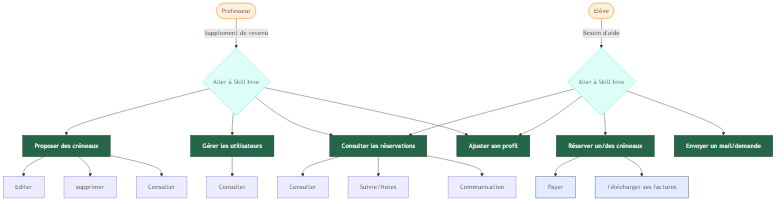
<i style="width: 100%; display: block; margin: auto; padding-left: 8px;">
  En fonction de son rôle, l’utilisateur peut accéder à des fonctionnalités différentes.

  En tant que professeur / admin :
  <ul>
    <li>Créer, consulter, supprimer ou éditer des créneaux</li>
    <li>Consulter la liste des élèves et leurs profils</li>
    <li>Consulter les réservations ou communiquer avec les élèves</li>
  </ul>

  En tant qu’élève :
  <ul>
    <li>Réserver et payer un créneau</li>
    <li>Consulter les réservations et commandes</li>
    <li>Communiquer avec les professeurs ou laisser des notes</li>
    <li>Envoyer des mails, suggestions ou réclamations</li>
  </ul>
</i>
</div>

#### Page d’accueil (Landing page)
La page d’accueil, accessible à tous, présente brièvement le principe de fonctionnement de l’application et ses avantages. Elle intègre un menu de navigation permettant :

-   D’accéder au profil public du professeur.
-   De se connecter ou de s’inscrire pour accéder au dashboard (partie privée de l’application).

#### Espace utilisateur (Dashboard)
Une fois connecté, l’eleve accède au tableau de bord. Par défaut, le menu principal est affiché à gauche et permet de naviguer entre les différentes sections.

1.  Notifications/Activités
1.  Calendrier interactif
2.  Historique des réservations.
3.  Communication avec le professeur.
5.  Commandes et paiement
6.  Gestion des informations personnelles.

##### Notifications
Page par défaut du dashboard : Notifications
La page de notifications est la page d’accueil du dashboard, permettant à l’utilisateur de voir en un coup d’œil l’activité récente. Elle présente :

* Toutes les notifications, classées par ordre chronologique afin de ne manquer aucun événement important.

* Un système de filtrage permettant de distinguer rapidement les notifications vues de celles non vues.

* Un résumé synthétique de l’activité hebdomadaire, offrant une vision d’ensemble sur les événements récents (paiements, réservations, modifications de créneaux…).

##### Le calendrier interactif

Pour les eleves, ce calendrier Permet de consulter les créneaux disponibles du professeur, avec indication des prix et promotions éventuelles, d’afficher le planning sous différentes vues : jour, semaine ou mois et de sélectionner un ou plusieurs créneaux pour pré-réservation.

Lorsqu’un créneau est choisi, il est réservé temporairement (15 minutes) le temps de finaliser le paiement. Pendant cette période, il n’apparaît plus comme disponible pour les autres utilisateurs.

Pour le professeur, ce calendrier est le coeur de l application, il permet de visualiser les creneaux, reserves, libres ou en en cours de reservation, mais egalement, il permet l ajout  des nouveaux creneau ou l edition des creneaux libres. tel que le changement des prix, l ajout de promotion ou  la suppression.

##### Historique et réservations
Un onglet dédié permet de consulter :
*   Les réservations à venir.
*   Les réservations passées.

##### Profil élève/Professeur
L’onglet Profil regroupe :
*   Les informations personnelles (nom, prénom, coordonnées…).
*   Les informations de formation (utiles au professeur pour préparer les cours).
*   Les adresses (facturation, domicile…).
*   Une description personnelle libre.
*   Les liens vers les réseaux sociaux (LinkedIn, GitHub…).

Ces informations sont visibles par le professeur afin d’adapter son enseignement.

##### Contact
L’onglet Contact permet d’envoyer un message directement au professeur pour :
*   Demander un remboursement.
*   Poser une question.
*   Obtenir des renseignements divers.


##### Onglet Utilisateurs (professeur)
Fonctionnalités administratives pour le professeur
Le professeur dispose également des droits d’administrateur, il accède à des fonctionnalités avancées via l’onglet Utilisateurs. Cet onglet lui permet de :

<div style="width: 100%; margin-bottom: 8px;">
  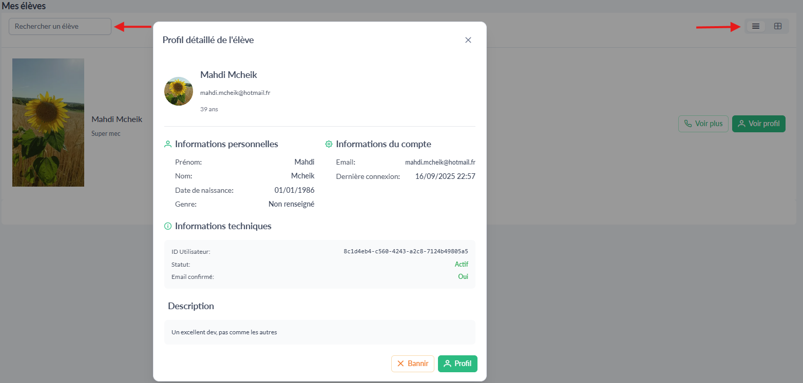
</div>

* Lister tous les élèves inscrits sur la plateforme.

* Rechercher un profil spécifique grâce à un champ de recherche.

* Consulter les informations détaillées de chaque élève (coordonnées, historique de réservations…).

* Bannir un compte si nécessaire, en cas de comportement inapproprié ou de problème de sécurité.

Pour plus de confort, j'ai mis en place deux modes d’affichage :

* Une vue en liste, compacte et adaptée à un grand nombre d’élèves.

* Une vue en grille, où chaque étudiant est présenté sous forme de carte, ce qui facilite la lecture des informations principales d’un coup d’œil.

### 2.2 Cas d’usage principaux
- Réserver un cours.
- Payer en ligne.
- Consulter l’historique.
- Envoyer un message au professeur.

### 2.3 Acteurs et rôles
| Acteur          | Rôle principal |
|-----------------|---------------|
| Professeur      | Administrer et donner les cours |
| Élève           | Réserver et suivre les cours |

---

## 3. Fonctionnalités détaillées
1. Inscription et authentification.
2. Réservation de créneaux disponibles.
3. Paiement sécurisé.
4. Consultation de l’historique.
5. Messagerie.
6. Gestion des tarifs et disponibilités.
7. Facturation
8. Notification/signalR


### 1. Inscription et authentification

L'inscription constitue le point d'entrée de l'application et s'articule autour d'un processus en deux étapes. Lors de l'inscription, l'utilisateur renseigne ses informations personnelles (nom, prénom, email, mot de passe) via un formulaire sécurisé avec validation en temps réel. Le système vérifie la robustesse du mot de passe (8 caractères minimum, combinaison de majuscules, minuscules, chiffres et caractères spéciaux) et l'unicité de l'adresse email. Deux consentements distincts sont requis : l'acceptation de la politique de confidentialité et l'autorisation de traitement des données personnelles conformément au RGPD. Une fois l'inscription validée, l'utilisateur reçoit un email de confirmation pour activer son compte.
<div style="width: 100%;">
  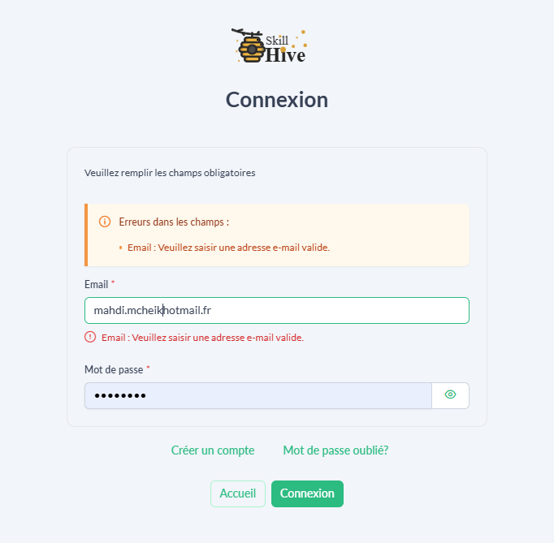
  <i  style="width: 90%;display: block; margin: auto;">Les formulaires sont construits à partir d’un modèle unique qui guide l’utilisateur à chaque étape. Ils affichent des indices contextuels pour faciliter la saisie et mettent en évidence les erreurs, à la fois au niveau de chaque champ de saisie et, si nécessaire, au niveau de la section entière, comme illustré dans cette image.
</i>
</div>

L'authentification repose sur un système dual optimisant sécurité et expérience utilisateur. La connexion initiale génère un JWT court (30 minutes) stocké en mémoire et un refresh token long (7 jours) stocké dans un cookie sécurisé. Lors des visites ultérieures, un mécanisme automatique utilise le refresh token pour régénérer transparentement les credentials, évitant à l'utilisateur de se reconnecter manuellement. Cette approche protège contre les attaques XSS tout en maintenant une session persistante et fluide.

**Gestion sécurisée des tokens de connexion** : Pour des raisons de sécurité, le token d’accès n’est pas stocké dans le localStorage ni dans le sessionStorage, afin d’éviter toute exposition aux attaques de type XSS (Cross-Site Scripting). À la place, il est conservé en mémoire active (en RAM) pendant toute la durée de la session. Ce token est volontairement de courte durée de vie : une fois expiré, il est automatiquement renouvelé grâce à un refresh token.

Le refresh token, quant à lui, est stocké de manière sécurisée dans un cookie HTTP-only, configuré avec les attributs Secure, SameSite=Strict et HttpOnly. Cela permet d’éviter qu’il soit accessible depuis le JavaScript du navigateur et le protège contre les attaques de type CSRF.

Ce mécanisme permet d’assurer un équilibre optimal entre sécurité et expérience utilisateur : les utilisateurs restent connectés sans avoir à ressaisir leurs identifiants trop fréquemment, tout en minimisant les risques liés à la compromission d’un token.

Plus de détails techniques sur la mise en place de ce système sont présentés dans la section Sécurité du dossier.
Plus de détails techniques sur le profil dans le RGPD.

### 2. Réservation de créneaux disponibles

Le système de réservation s'appuie sur un calendrier interactif FullCalendar offrant trois vues (jour, semaine, mois) pour optimiser la visualisation selon les préférences utilisateur. Les créneaux disponibles apparaissent en temps réel avec leurs tarifs respectifs et d'éventuelles promotions. L'élève sélectionne un ou plusieurs créneaux consécutifs, déclenchant une pré-réservation temporaire de 15 minutes. Durant cette période critique, les créneaux choisis disparaissent de la disponibilité publique, évitant les conflits de réservation. 

<div style="width: 100%; margin-bottom: 8px;">
  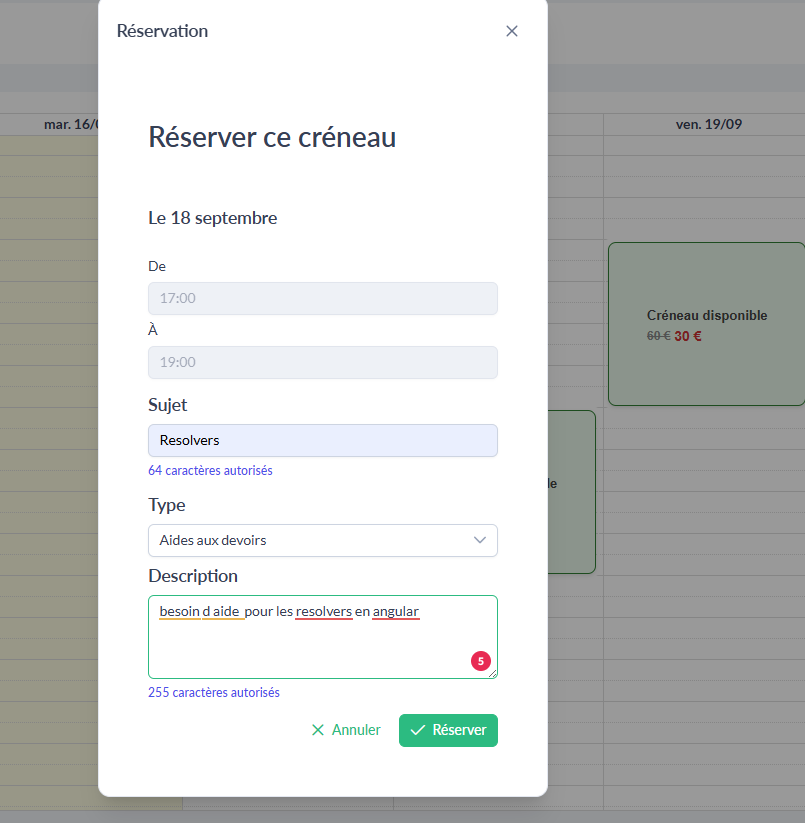
  <i>Le modal de réservation permet de saisir un titre pour le problème, de choisir une catégorie (aide aux devoirs, préparation d’examen, etc.) et de décrire le problème en détail.</i>
</div>

Le processus intègre une validation intelligente empêchant les réservations en double, les créneaux passés ou les chevauchements. Si le paiement n'est pas finalisé dans le délai imparti, les créneaux redeviennent automatiquement disponibles et une notification de libération est diffusée. Cette mécanique garantit une gestion optimale des disponibilités sans blocages inutiles. Un changement implique une annulation immediate du checkout de paiement.


**Échange d’informations après réservation**
Une fois la réservation payée, l’élève peut consulter la notification associée et fournir des informations complémentaires grâce à une petite fenêtre de discussion intégrée. De son côté, le professeur peut lire ces messages et y répondre directement.

<div style="width: 100%; margin-bottom: 8px;">
  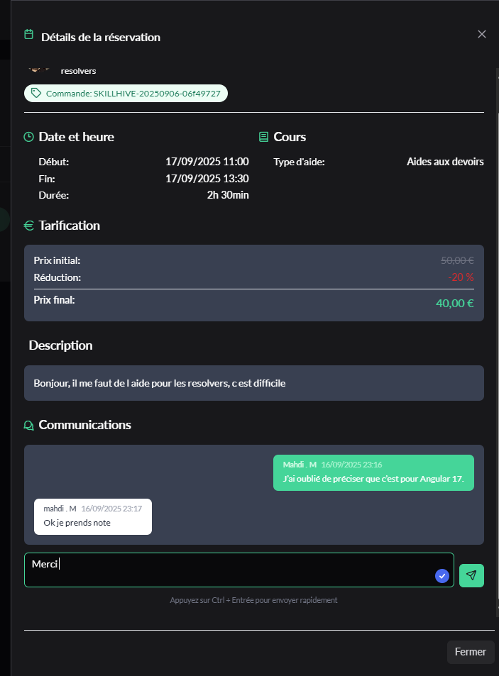
</div>

Ce système n’a pas vocation à devenir une application de messagerie complète : il est conçu pour des échanges ponctuels et exceptionnels, par exemple pour préciser le sujet de la séance, signaler un changement de disponibilité ou permettre au professeur de laisser des commentaires et suivis après le cours.

Plus de détails techniques dans la prtie paiement.
### 3. Paiement sécurisé

L'intégration Stripe assure un processus de paiement garantissant la sécurité maximale des données bancaires. L'interface de paiement s'adapte automatiquement au montant total (créneaux + promotions/réductions), affiche un récapitulatif détaillé et propose les principales méthodes de paiement européennes.

#### 3.1 Deroulement
Une fois la commande prête, le client dispose de 15 minutes pour effectuer le paiement, avec un compte à rebours affichant le temps restant. En cliquant sur « Payer », la redirection vers l’interface Stripe s’effectue automatiquement après la création côté serveur d’un checkout valable 15 minutes. Si le délai expire, le checkout est annulé automatiquement.

<div style="width: 100%;">
  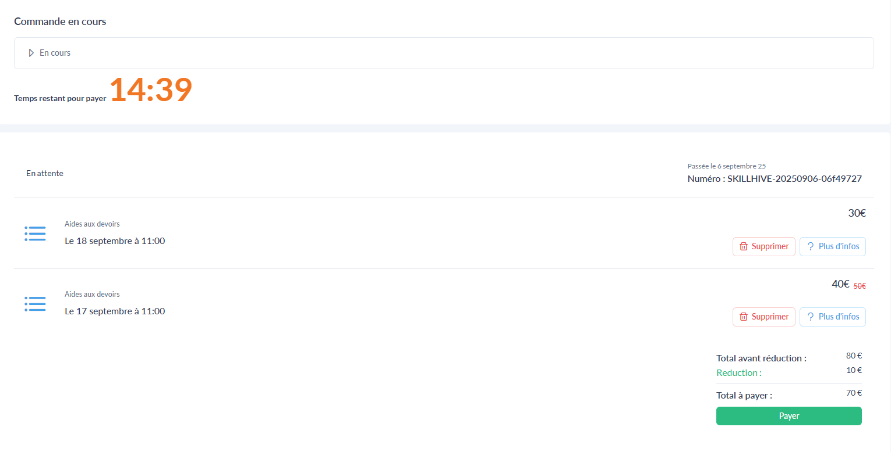
  <i  style="width: 90%;display: block; margin: auto;">Le temps restant pour effectuer le paiement est affiché en orange afin d’attirer l’attention de l’utilisateur. Ce compte à rebours est automatiquement réinitialisé dès que la commande est modifiée (par exemple lorsqu’elle est incrémentée) ou lorsqu’un nouveau checkout est créé.
</i>
</div>

L’interface Stripe détaille les articles à régler ainsi que le montant total. À l’issue du paiement, si la transaction est validée, le client est redirigé vers la page de confirmation. En cas d’échec, Stripe indique que le paiement n’a pas abouti.

#### 3.2 Précautions et sécurité

Les créneaux constituent des articles à quantité limitée avec des contraintes temporelles strictes. Chaque créneau réservé étant unique, il doit être payé dans les plus brefs délais pour éviter de bloquer l'accès aux autres élèves. Cette contrainte de paiement rapide est donc essentielle au bon fonctionnement du système.

Côté serveur, la création du checkout déclenche automatiquement un service en arrière-plan qui annulera la réservation si aucun paiement n'est initié dans les 15 minutes imparties. De même, le checkout de paiement active un service similaire qui sera annulé soit lors de l'acceptation du paiement, soit à l'expiration du délai.

Des précautions supplémentaires ont été implémentées : si l'élève modifie sa commande dans un autre onglet ou sur un autre appareil après la création du checkout, toute modification entraîne l'annulation automatique du checkout en cours et le refus du paiement.
```c#
        public async Task<bool> BookSlot(BookingCreateDTO newBookingCreateDTO, UserApp booker)
        {
            ...
            Order order = await orderService.GetOrCreateCurrentOrderByUserAsync(booker);
            ...
            if (order.CheckoutID is not null)
            {
                try
                {
                    await jobChron.ExpireCheckout(order.CheckoutID);
                    order.ResetCheckout();
                }
                ...
            }
```
*Lors de la réservation, vérification et annulation d'un checkout existant*
```C#
        public async Task ExpireCheckout(string checkoutId)
        {
            try
            {
                ...
                StripeConfiguration.ApiKey = EnvironmentVariables.STRIPE_SECRET_KEY;
                var service = new Stripe.Checkout.SessionService();
                Stripe.Checkout.Session session = service.Expire(checkoutId);
            }
            ...
        }
```

Côté serveur, un webhook dédié à l'écoute des événements Stripe met à jour les commandes et réservations en fonction de l'aboutissement du paiement.
```C#
        public async Task<bool> CheckPaymentAndUpdateOrder(...)
        {
                ...
                // si paiement termine'
                if (stripeEvent.Type == "checkout.session.completed")
                {
                    var session = stripeEvent.Data.Object as Session;
                    // si paiment accepte'
                    if (session.PaymentStatus == "paid")
                    {
                        ...
                        if (orderId is not null && session.PaymentIntentId is not null)
                        {
                                // notifications
                                ...
                                // annulation du service de nettoyage
                                jobChron.CancelScheuledJob(newOrder.Id.ToString());
                                // mettre a jour la commande, la marquer comme paye'
                                return await orderService.UpdateOrderStatus(
                                    orderGuid,
                                    EnumBookingStatus.Paid,
                                    session.PaymentIntentId
                                );
```
Suite à l’acceptation ou au refus d’un paiement, le serveur est directement informé par Stripe via un webhook. Cette approche garantit que l’information provient d’une source fiable et qu’elle ne peut pas être falsifiée par le client.

Dès réception de cet événement, le serveur met à jour l’état de la commande (par exemple, marquée comme payée ou échouée) puis notifie le client en temps réel, généralement via un mécanisme comme SignalR ou WebSocket.

Il est important de noter que le client ne communique jamais lui-même le résultat du paiement au serveur : cela évite toute tentative de fraude (comme le fait d’envoyer manuellement une requête prétendant qu’un paiement a été validé).

### 4. Consultation de l'historique

Les réservations sont organisées par statut (à payer ou passées) avec pagination pour une navigation optimale. Chaque entrée présente les détails complets : date, heure, durée, prix payé et statut de la session. En cliquant sur une réservation, un modal s'affiche, permettant également la modification de la commande en cours.

<div style="width: 100%;">
  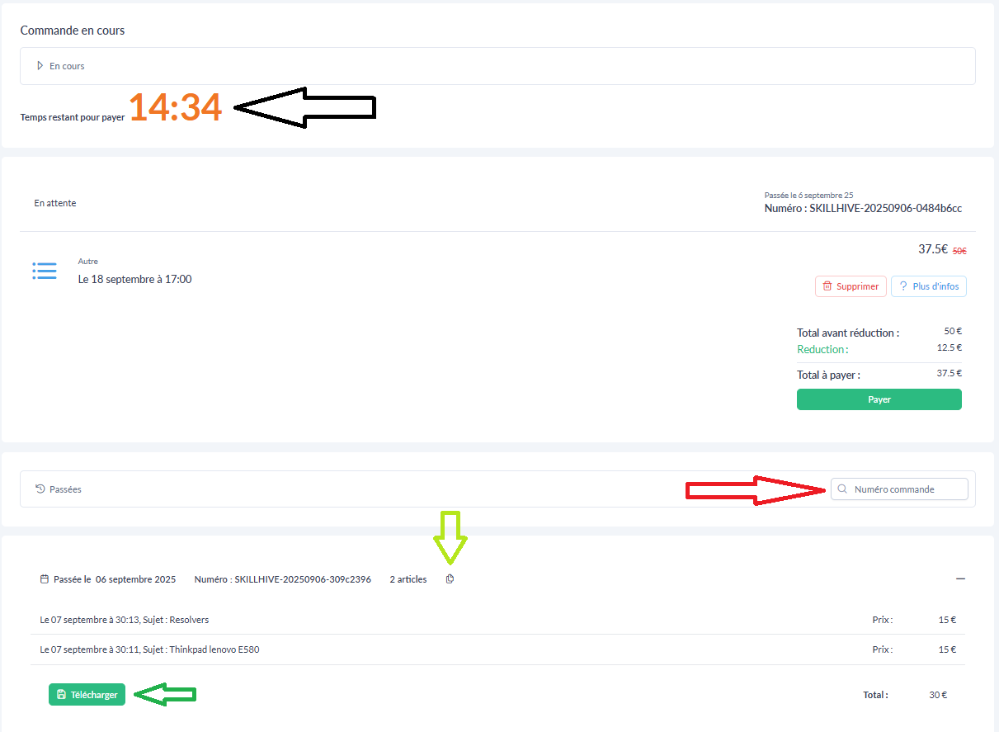
  <i  style="width: 90%;display: block; margin: auto;">La page des commandes présente plusieurs éléments visuels pour faciliter la gestion :

En noir : la commande en cours, avec son temps restant pour effectuer le paiement, les détails complets de la commande ainsi que les boutons de contrôle associés.

En rouge : le champ de recherche permettant de retrouver les anciennes commandes.

En vert foncé : le bouton de téléchargement de la facture au format PDF.

En vert clair : le bouton qui permet de copier les détails techniques de la commande, afin que le client puisse les transmettre facilement à l’administrateur en cas de besoin.</i>
</div>

Les commandes passées sont classées par ordre chronologique descendant, offrant à l'utilisateur la possibilité de télécharger ses factures individuellement, mais également un système de recherche textuelle est mis en place pour faciliter la recherche. 

### 5. Messagerie

La messagerie intégrée de Trevo facilite la communication directe entre l’élève et le professeur. Cette interface simplifiée est conçue pour traiter efficacement les demandes courantes, telles que :

* Les demandes de remboursement.

* Les reports ou annulations de cours.

* Les questions pédagogiques.

<div style="width: 100%;"> 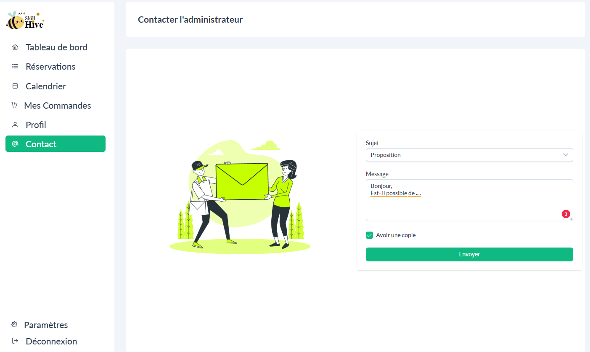 <i style="width: 450px; display: block; margin: auto; margin-top: 6px;"> Plusieurs catégories de demandes prédéfinies avec possibilité de recevoir une copie par email pour plus de traçabilité. </i> </div>

En complément de la messagerie interne, le système propose également l’envoi par email. Cette fonctionnalité permet de garantir la traçabilité des échanges et d’assurer que les messages puissent être reçus même si le serveur de l’application rencontre un problème. Ainsi, l’élève et le professeur disposent toujours d’un canal de communication fiable.

### 6. Gestion des tarifs et disponibilités

Cette fonctionnalité, réservée exclusivement au professeur, constitue le véritable cœur opérationnel de l’application. Elle centralise l’organisation et la planification des séances.

* Grâce à un calendrier interactif, le professeur peut :

* Créer de nouveaux créneaux horaires pour proposer des séances aux élèves.

* Modifier les créneaux existants en ajustant la date, l’horaire ou le tarif.

* Supprimer un créneau si celui-ci n’est plus disponible.

Ajouter des promotions pour mettre en avant des créneaux spécifiques et encourager les réservations.

Cette interface permet une gestion souple et rapide de l’emploi du temps. L’enseignant garde un contrôle complet sur la disponibilité des séances, tout en pouvant réagir immédiatement aux imprévus (par exemple en ajustant le prix d’un créneau ou en créant une offre spéciale pour remplir les places vacantes).

<div style="width: 100%;">
  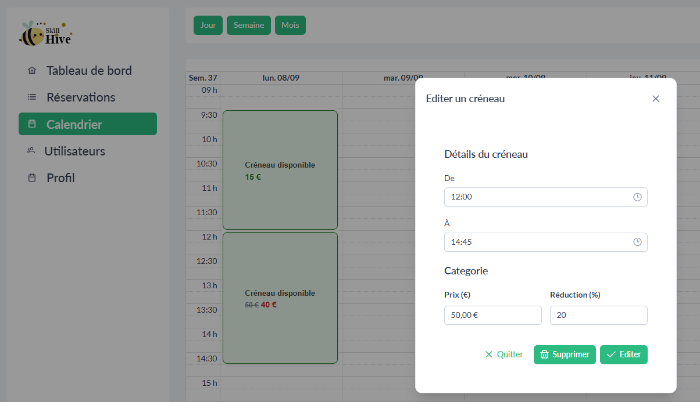
  <i  style="width: 450px;display: block; margin: auto; margin-top: 8px">Exemple de popup permettant de modifier le prix d’un créneau : le professeur peut ajuster le tarif en quelques clics sans quitter le calendrier.</i>
</div>
Cette approche améliore considérablement l’efficacité de la gestion des cours : les modifications sont instantanément prises en compte dans le système, garantissant une information toujours à jour pour les élèves.

### 7. Facturation

Afin de répondre aux exigences légales françaises, le système de facturation a été conçu pour générer des documents conformes aux normes en vigueur. Chaque facture produite respecte :

* Une numérotation séquentielle afin de garantir la traçabilité et l’unicité des documents.

* L’affichage de la TVA.

La génération des factures se fait à la demande, ce qui évite d’occuper inutilement de l’espace de stockage avec des fichiers inutilisés. Les factures sont créées dynamiquement au format PDF grâce à la librairie QuestPDF. Cette bibliothèque est particulièrement adaptée aux environnements de production car elle :

Offre des performances très élevées avec un temps de génération quasi instantané.

Consomme peu de ressources système par rapport à des solutions plus lourdes comme Puppeteer + Chromium.

Permet une flexibilité importante : le développeur peut facilement adapter le modèle de facture en cas d’évolution légale ou de correction nécessaire.

Ce fonctionnement permet de garantir un système à la fois rapide, économique en stockage et évolutif. Le résultat est une expérience fluide pour l’utilisateur, tout en maintenant une conformité réglementaire stricte.


<div style="width: 100%;">
  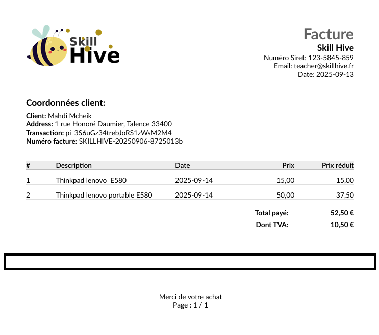
  <i  style="width: 450px;display: block; margin: auto; margin-top: 8px">Exemple de facture générée automatiquement avec QuestPDF, conforme aux obligations légales (numérotation séquentielle et TVA).</i>
</div>


### 8. Notifications
La page Notifications constitue l’accueil du dashboard. Elle offre à l’utilisateur une vue immédiate sur l’activité récente et met en avant :

L’ensemble des notifications, organisées par ordre chronologique pour garantir qu’aucun événement important ne soit manqué.

Un système de filtrage permettant de différencier facilement les notifications déjà consultées de celles encore non lues.

Un récapitulatif hebdomadaire clair et concis, donnant une vision globale des événements récents (paiements, réservations, modifications de créneaux, etc.).

<div style="width: 100%; margin-bottom: 8px;">
  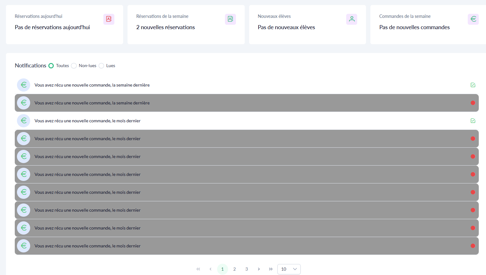
  <i>En en-tête de la page, un petit résumé de l’activité hebdomadaire permet d’avoir une vue d’ensemble des événements récents (créneaux créés, réservations, paiements, etc.). Les notifications détaillées sont affichées en bas de la page, sous forme de liste paginée. L’utilisateur dispose également d’un système de filtrage pour afficher uniquement les notifications vues ou non vues.</i>
</div>


**Notifications en temps réel avec SignalR**
Pour offrir une expérience utilisateur fluide et réactive, le système de notifications utilise SignalR, la bibliothèque temps réel de .NET. Grâce à cette technologie, les notifications sont transmises instantanément depuis le serveur vers le client, sans que ce dernier ait besoin d’actualiser la page.

Ce mécanisme permet au professeur et aux élèves d’être informés en direct des événements importants, comme :

* La création ou la modification d’un créneau.

* La confirmation de la réservation.

* L’arrivée d’un nouveau message ou d’une nouvelle réservation.

* La mise a jour du profil.

L’utilisation de SignalR garantit donc un flux d’informations en temps réel, améliorant la réactivité de l’application et réduisant les risques de décalage entre l’état du serveur et ce que l’utilisateur voit à l’écran.


La gestion du profil constitue l'une des fonctionnalités centrales de l'application, offrant aux utilisateurs un espace personnel complet et modulaire. Cette section permet une personnalisation approfondie des informations utilisateur tout en facilitant les interactions pédagogiques entre professeurs et élèves.

#### 8.1 Interface de gestion du profil

L'interface de profil adopte une approche moderne et intuitive, structurée autour de sections thématiques clairement délimitées. Chaque section dispose de ses propres contrôles d'édition, permettant une gestion granulaire des informations personnelles. L'interface responsive s'adapte parfaitement aux différents formats d'écran, garantissant une expérience utilisateur optimale sur desktop et mobile.

<div style="width: 100%;">
  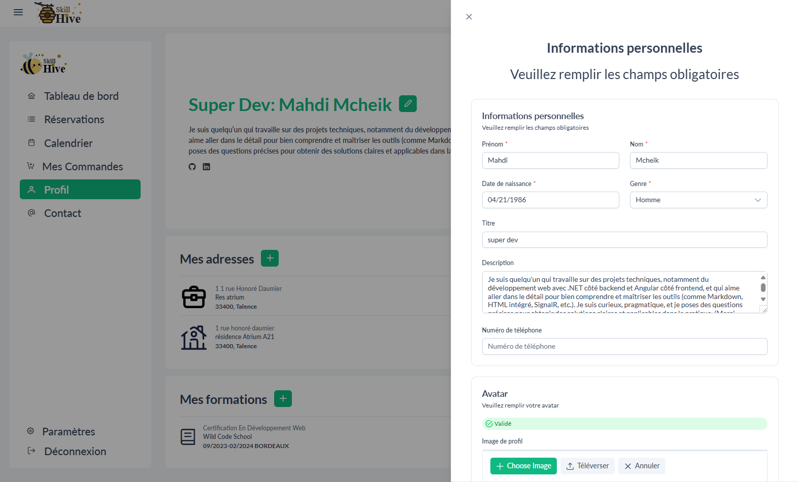
  <i  style="width: 450px;display: block; margin: auto; margin-top: 8px">Modal d'édition du profil personnel avec validation en temps réel</i>
</div>

Les modales d'édition intègrent une validation en temps réel avec feedback immédiat, guidant l'utilisateur dans la saisie et prévenant les erreurs de format.

#### 8.2 Gestion des adresses multiples

Le système d'adresses offre une flexibilité maximale pour répondre aux besoins variés des utilisateurs. L'architecture modulaire permet la gestion de plusieurs types d'adresses avec des finalités distinctes :
Adresse de *domicile*, *facturation*, *livraison*, *travail*.

#### 8.3 Gestion des formations et parcours éducatif

La section formations constitue un élément différenciant de l'application, permettant au professeur d'adapter précisément son enseignement au profil et aux objectifs de chaque élève. Cette fonctionnalité dépasse la simple collecte d'informations pour devenir un véritable outil pédagogique.


#### 8.4 Sécurité et confidentialité des données

La gestion des profils intègre des mesures de sécurité strictes conformes au RGPD :

**Contrôle d'accès granulaire** : Système de permissions permettant aux élèves de contrôler précisément quelles informations sont visibles par le professeur.

**Anonymisation automatique (en cours)** : Processus d'anonymisation des données lors de la suppression de compte, préservant les statistiques globales tout en respectant le droit à l'effacement.

**Chiffrement des données sensibles** : La protection des informations personnelles est une priorité essentielle dans notre projet. Parmi les données les plus critiques se trouvent les adresses précises des étudiants, qui ne doivent en aucun cas être accessibles en clair dans la base de données.

Pour répondre à cet enjeu, un mécanisme de chiffrement symétrique a été mis en place en utilisant l’algorithme AES (Advanced Encryption Standard), fourni nativement par la bibliothèque System.Security.Cryptography de .NET. Lorsqu’une nouvelle adresse est enregistrée, seules les parties sensibles — comme le nom de la rue et le numéro — sont chiffrées avant d’être stockées. Cela signifie que même en cas de fuite de la base de données, il est impossible pour un attaquant de déduire l’adresse exacte d’un étudiant.

Dans l’application, seules deux parties ont la capacité de déchiffrer ces données :

* L’élève lui-même, lorsqu’il consulte ou modifie son profil.

* Le propriétaire du site, pour des besoins d’administration ou de support.

Ce fonctionnement est illustré dans l’exemple suivant : 

```csharp
     public async Task<AddressResponseDTO> AddAddress(AddressCreateDTO addressCreate, string userId)
{
    try
    {
        // ..
        // Chiffrement des données sensibles avant l'insertion en base
        var encryptedAddress = AddressEncryptionHelper.EncryptAddressDto(addressCreate, encryptionService);
        var address = encryptedAddress.ToAddress(userId);
        
        //..
        // Déchiffrement lorsque l'information doit être lue
        AddressEncryptionHelper.DecryptAddress(address, encryptionService);
        
        return address.ToAddressDTO();
    }
    // ..
}

```
Ici, le service encryptionService encapsule la logique de chiffrement et de déchiffrement. L’algorithme AES est utilisé avec une clé de chiffrement sécurisée, générée et stockée de manière à empêcher tout accès non autorisé.

Visuellement, la différence est nette : dans l’interface, l’utilisateur voit son adresse en clair, mais dans la base de données, la rue et la ville apparaissent sous forme de texte chiffré, ce qui les rend incompréhensibles sans la clé : 

<div style="width: 100%;"> 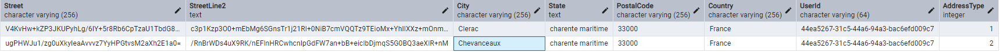 <i style="width: 450px; display: block; margin: auto; margin-top: 8px;"> Exemple : la ville et la rue sont chiffrées — la base de données ne contient donc pas l’adresse en clair. </i> </div>

Cette approche répond aux bonnes pratiques de sécurité (notamment celles recommandées par l’OWASP), en minimisant l’impact potentiel d’une fuite de données et en renforçant la confidentialité des étudiants.

## 4. Architecture technique
### 4.1 Technologies utilisées

#### Frontend : Angular 19

Angular 19 représente la dernière version du framework développé par Google, offrant une approche moderne et robuste pour le développement d'applications web. Le choix d'Angular se justifie par plusieurs avantages significatifs par rapport aux autres frameworks :

- **Architecture structurée** : Angular impose une architecture claire basée sur les composants, services et modules, facilitant la maintenance et l'évolutivité du code
- **TypeScript natif** : L'intégration native de TypeScript offre une meilleure détection d'erreurs à la compilation et améliore la productivité des développeurs
- **Écosystème complet** : Angular CLI, Angular Material, et un ensemble d'outils intégrés accélèrent le développement
- **Support à long terme** : Google assure un support LTS (Long Term Support) offrant une stabilité pour les projets d'entreprise

#### Librairies Frontend utilisées

L'application s'appuie sur un ensemble de librairies spécialisées pour offrir une expérience utilisateur riche :

**PrimeNG (v19.0.5)** : Cette suite de composants UI pour Angular fournit plus de 100 composants prêts à l'emploi (calendriers, tableaux, formulaires, modales). PrimeNG a été choisi pour sa compatibilité native avec Angular, sa documentation exhaustive et ses thèmes personnalisables qui s'intègrent parfaitement avec notre design system.

**Tailwind CSS (v3.4.17) avec tailwindcss-primeui** : Framework CSS utility-first qui permet un développement rapide et une personnalisation fine. L'intégration avec PrimeUI assure une cohérence visuelle entre les composants custom et ceux de PrimeNG.

**FullCalendar (v6.1.15)** : Bibliothèque spécialisée dans l'affichage de calendriers interactifs, essentielle pour la gestion des créneaux de cours. Elle offre des vues multiples (jour, semaine, mois) et une intégration native avec Angular.


**openapi-typescript-codegen** : Outil automatisant la génération du code TypeScript client à partir de la spécification OpenAPI du backend. Cette approche garantit une synchronisation parfaite entre l'API et le frontend, élimine les erreurs de typage et accélère le développement en générant automatiquement les services, modèles et types TypeScript correspondant aux endpoints de l'API .NET.

#### Backend : .NET 8.0

.NET 8.0 constitue la plateforme backend, offrant performance, sécurité et maintenabilité. Ses avantages incluent :

- **Performance native** : Compilation native et optimisations avancées
- **Écosystème riche** : Vaste bibliothèque de packages NuGet
- **Sécurité intégrée** : Fonctionnalités de sécurité built-in et conformité aux standards
- **Interopérabilité** : Support multi-plateforme (Windows, Linux, macOS)
- **Support Microsoft** : Maintenance et évolutions assurées par Microsoft

#### Librairies Backend principales

**Entity Framework Core avec Npgsql.EntityFrameworkCore.PostgreSQL (v8.0.10)** : ORM moderne permettant l'interaction avec PostgreSQL via des objets .NET, avec support des migrations automatiques et optimisations de requêtes.

**ASP.NET Core Identity (v8.0.10)** : Framework d'authentification et d'autorisation intégré gérant les utilisateurs, rôles et politiques de sécurité.

**Stripe.net (v47.3.0)** : SDK officiel pour l'intégration des paiements Stripe, garantissant sécurité et conformité PCI DSS.

**Hangfire (v1.8.18)** : Framework de gestion des tâches en arrière-plan pour le traitement asynchrone (envoi d'emails, nettoyage des réservations expirées).

**Swashbuckle.AspNetCore (v6.9.0)** : Génération automatique de la documentation API OpenAPI/Swagger facilitant l'intégration frontend et les tests.

**QuestPdf** : Génération de PDF (factures).

**Bogus (v35.6.1)** : Générateur de données de test facilitant le développement et les tests de charge avec des jeux de données réalistes.

#### Base de données : PostgreSQL 15
PostgreSQL a été retenu pour ses performances, sa fiabilité et ses fonctionnalités avancées (JSONB, indexation sophistiquée, contraintes complexes). Sa compatibilité native avec .NET via Npgsql garantit une intégration optimale.
#### Paiement : Stripe
Stripe s'impose comme référence pour les paiements en ligne grâce à sa sécurité PCI DSS Level 1, son API intuitive, et son support international. L'intégration avec .NET via le SDK officiel assure fiabilité et conformité réglementaire.

#### Hébergement : VPS chez Hostinger
Le choix d'un VPS offre flexibilité, contrôle total sur l'environnement, et rapport qualité-prix optimal pour une application de cette envergure. L'architecture conteneurisée avec Docker facilite le déploiement et la scalabilité.

### 4.2 Schéma d’architecture
L’architecture de l’application repose sur une séparation en trois couches principales.
Le frontend, développé en Angular, fournit une interface utilisateur interactive et communique avec le backend via des appels REST et des connexions temps réel (SignalR).
Le backend, développé en .NET, expose une API sécurisée qui gère la logique métier, l’authentification et la validation des données. Il interagit avec la base PostgreSQL via Entity Framework Core, garantissant une bonne abstraction de la couche de persistance.
Enfin, la base de données stocke les informations métier de manière relationnelle et assure l’intégrité via des contraintes.

voici un diagrame qui illustre ces interactions
<div style="width: 100%;">
  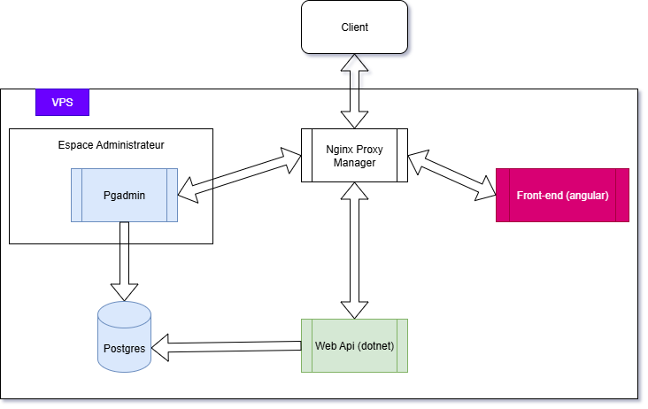
  <i  style="width: 450px;display: block; margin: auto; margin-top: 8px">Schema d'interaction du client au serveur et base de données en passant par le reverse proxy</i>
</div>

Le reverse proxy joue un rôle crucial dans la communication entre les différents composants de l’application.
Lorsqu’un client souhaite accéder à l’application, c’est le reverse proxy qui reçoit la première requête. Dans un premier temps, il retourne les fichiers statiques correspondant à la partie frontend Angular, permettant ainsi le chargement de l’interface utilisateur dans le navigateur.

Une fois l’interface Angular chargée, celle-ci effectue des appels aux endpoints exposés par le backend .NET. Là encore, le reverse proxy intervient : il redirige les requêtes entrantes vers le conteneur correspondant au serveur applicatif.
Cette approche permet d’exposer une seule adresse publique vers l’extérieur, tout en masquant la complexité de l’infrastructure interne (multiples conteneurs).

En interne, le serveur .NET et la base de données PostgreSQL communiquent directement via un réseau privé Docker (bridge network). Cette isolation garantit à la fois des performances optimales et une meilleure sécurité, car la base n’est pas accessible directement depuis l’extérieur.

Enfin, un administrateur peut tout de même interagir avec la base de données grâce à l’outil pgAdmin, également exécuté dans un conteneur. Celui-ci est exposé via le reverse proxy sur un port dédié, permettant ainsi une gestion simplifiée et sécurisée de la base de données sans casser l’isolation interne.
### 4.3 Structure de la base de données
La conception de la base de données repose principalement sur deux axes fondamentaux : la gestion des utilisateurs (professeurs et élèves) et la gestion des réservations (créneaux, réservations et paiements).

Chaque utilisateur dispose d’un profil qui regroupe les informations nécessaires à l’interaction entre professeurs et élèves. Ce profil contient notamment des données personnelles (nom, coordonnées, etc.), une liste d’adresses, ainsi qu’un ensemble de formations suivies ou dispensées.

Les professeurs ont la possibilité de créer des créneaux correspondant à une date, une période et un tarif. Ces créneaux constituent l’offre de disponibilité mise à disposition des élèves. De leur côté, les élèves peuvent réserver un ou plusieurs de ces créneaux.

Une réservation contient des informations complémentaires, telles que le sujet de la séance, une description, ainsi que les coordonnées de l’élève concerné. Les réservations sont ensuite regroupées sous la forme d’une commande : une commande représente un ensemble de réservations réglées en une seule transaction. Chaque commande conserve les détails du paiement (provenant de l’API Stripe), incluant le montant total réglé ainsi que la date de paiement.

Pour la gestion de l’authentification et de la sécurité, l’application s’appuie sur la librairie Identity de .NET, ce qui permet de bénéficier nativement d’un ensemble de tables dédiées à la gestion des utilisateurs, rôles, mots de passe et jetons d’accès.
<div style="width: 100%;">
  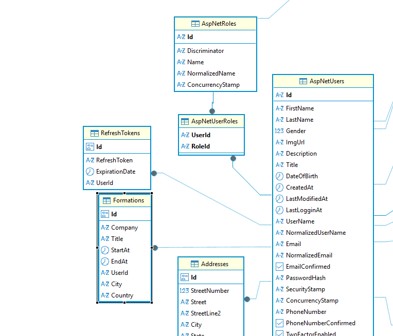
  <i  style="width: 450px;display: block; margin: auto; margin-top: 8px">Illustration des relations utlisateur, formations, réservations et tables d'authentification</i>
</div>

La figure suivante illustre plus en détail la partie réservation, en mettant en évidence les relations entre les entités principales (utilisateurs, créneaux, réservations et commandes).

<div style="width: 100%;">
  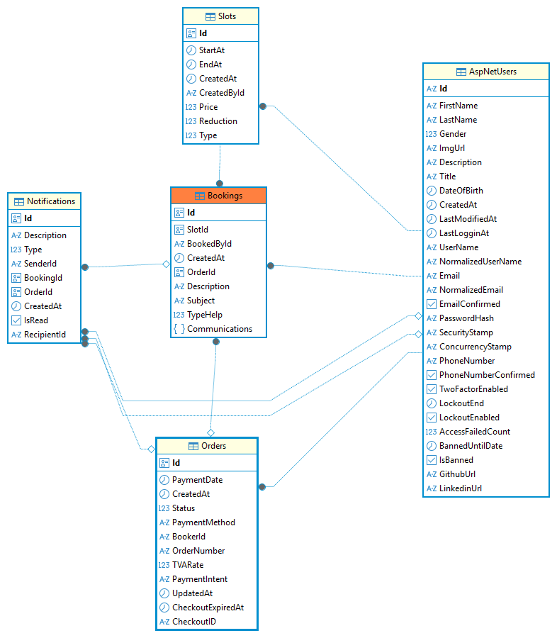
  <i  style="width: 450px;display: block; margin: auto; margin-top: 8px">Illustration des relations utlisateurs, réservations, créneaux et commades</i>
</div>

---

## 5. Conception
- Maquettes écran.
- Modèle de données.

### Cas d’utilisation

### Modèle de données 
#### MCD
Le MCD représente la structure conceptuelle de notre système de gestion de formations et réservations en ligne. Il illustre les entités principales et leurs relations métier (voir annexe).

#### MLD 
Dans les diagrames suivant, j'ulistre les relations principales en les differentes entités

<div style="width: 100%;">
  
  <i  style="width: 450px;display: block; margin: auto; margin-top: 8px">Profil de l'Utilisateur: roles, adresses et formations</i>
</div>

Les entités liées à la logique de réservation sont illustrées dans le diagram suivant
<div style="width: 100%;">
  
  <i  style="width: 450px;display: block; margin: auto; margin-top: 8px">Utilisateur et réservation : créneaux, réeservation, commande et notification</i>
</div>

#### Spécifications Techniques

**Système d'Authentification** : Utilisation d'ASP.NET Core Identity avec tables `AspNetUsers`, `AspNetRoles` et `AspNetUserRoles` pour la gestion des utilisateurs et des autorisations.

**Types de Données** :

- `uuid` : Identifiants uniques pour les entités métier
- `timestamptz` : Horodatage avec fuseau horaire pour PostgreSQL
- `decimal(18,2)` : Précision monétaire pour les prix et taux
- `jsonb` : Stockage JSON binaire pour les communications chat
- `text` : Texte de longueur variable pour les descriptions

**Contraintes d'Intégrité** :

- Clés étrangères avec actions de suppression configurées (`CASCADE`, `RESTRICT`, `SET NULL`)
- Contraintes de longueur sur les champs texte
- Valeurs par défaut pour les champs optionnels
- Index sur les clés étrangères pour optimiser les performances

**Particularités du Modèle** :

- Relation 1:1 entre `Slot` et `Booking` (un créneau ne peut être réservé qu'une fois)
- Relation N:M entre `User` et `Role` via la table de liaison `AspNetUserRoles`
- Système de notifications polymorphe pouvant référencer différents types d'entités
- Gestion des adresses multiples par utilisateur avec typage (domicile, travail, facturation)
- Système de réductions et calculs de prix avec propriétés calculées


#### Description des Entités Principales

**USER (Utilisateur)** : Entité centrale du système représentant les utilisateurs (étudiants, formateurs, administrateurs). Chaque utilisateur peut avoir plusieurs rôles et possède un profil complet avec informations personnelles et professionnelles.

**SLOT (Créneau)** : Représente les créneaux horaires disponibles créés par les formateurs. Chaque créneau a un prix, peut avoir une réduction et est typé selon le service proposé.

**BOOKING (Réservation)** : Entité de liaison entre un utilisateur et un créneau. Une réservation contient les détails de la demande d'aide et peut inclure des communications via chat.

**ORDER (Commande)** : Regroupe une ou plusieurs réservations pour le processus de paiement. Gère le cycle de vie commercial avec statuts, méthodes de paiement et TVA.

**CURSUS** : Représente les parcours de formation structurés par niveaux et catégories, permettant une organisation pédagogique cohérente.
---

## 6. Sécurité

La sécurité constitue un enjeu majeur pour une application gérant des données personnelles et des transactions financières.

### 6.1 Authentification et autorisation

#### Système d'authentification dual

L'application implémente un système d'authentification à double mécanisme pour optimiser à la fois la sécurité et l'expérience utilisateur :

**Authentification par identifiants** : Lors de la première connexion, l'utilisateur fournit ses identifiants (email/mot de passe). Le backend valide ces informations et génère :
- Un **JWT (JSON Web Token)** à durée de vie limitée (30 minutes) contenant les informations utilisateur et ses permissions
- Un **refresh token** à durée de vie étendue (7 jours) permettant le renouvellement automatique du JWT

**Authentification automatique par cookies** : Pour les sessions ultérieures, le mécanisme fonctionne ainsi :
1. Le refresh token est stocké dans un cookie **secure**, **strict** et **httpOnly**
2. Lors du rafraîchissement de la page, un interceptor Angular déclenche automatiquement une requête vers l'endpoint `/auth/refresh-token`
3. Le backend valide le refresh token et retourne un nouveau JWT avec les données utilisateur
4. Toutes les requêtes suivantes utilisent ce JWT pour l'authentification

#### Gestion des tokens côté frontend

Le frontend adopte une stratégie de stockage sécurisée :
- **JWT et données utilisateur** : Stockés en mémoire (variables JavaScript) pour éviter la persistance locale
- **Refresh token** : Stocké exclusivement dans un cookie avec les attributs de sécurité suivants :
  - `Secure` : Transmission uniquement via HTTPS
  - `SameSite=Strict` : Protection contre les attaques CSRF
  - `HttpOnly` : Inaccessible au JavaScript côté client

Cette approche offre une protection optimale contre les principales vulnérabilités :

### 6.2 Protection contre les attaques courantes

#### Protection XSS (Cross-Site Scripting)
- **Stockage en mémoire** : Les tokens JWT ne sont jamais persistés dans le localStorage ou sessionStorage, éliminant le risque d'exfiltration via du code JavaScript malveillant
- **Cookie HttpOnly** : Le refresh token est inaccessible au JavaScript, empêchant son vol par des scripts injectés
- **Validation des entrées** : Angular intègre nativement une protection contre l'injection de scripts dans les templates

#### Protection CSRF (Cross-Site Request Forgery)
- **Cookie SameSite=Strict** : Empêche l'envoi automatique du refresh token lors de requêtes cross-origin
- **JWT en headers** : L'utilisation de JWT dans les headers Authorization nécessite une action JavaScript explicite, impossible depuis un site tiers
- **Validation d'origine** : Vérification systématique de l'origine des requêtes côté backend

#### Protection contre l'injection SQL
L'utilisation d'**Entity Framework Core** comme ORM fournit une protection native contre les injections SQL :
- **Requêtes paramétrées** : Toutes les requêtes utilisent des paramètres typés, empêchant l'injection de code SQL
- **LINQ to SQL** : Les requêtes LINQ sont automatiquement converties en requêtes SQL sécurisées
- **Validation des modèles** : Les annotations de validation sur les modèles filtrent les données en amont

### 6.3 Chiffrement et protection des données

#### Gestion des mots de passe
- **Hachage BCrypt** : Les mots de passe sont hachés avec l'algorithme BCrypt (work factor 12) avant stockage
- **Salt unique** : Chaque mot de passe dispose d'un salt généré aléatoirement
- **Politique de mots de passe** : Validation de la complexité (8 caractères minimum, majuscules, minuscules, chiffres, caractères spéciaux)

#### Chiffrement des communications
- **HTTPS obligatoire** : Toutes les communications sont chiffrées via TLS 1.3
- **HSTS (HTTP Strict Transport Security)** : Headers configurés pour forcer l'utilisation d'HTTPS
- **Certificats SSL** : Utilisation de certificats Let's Encrypt avec renouvellement automatique

### 6.4 Conformité RGPD

#### Gestion des consentements
- **Consentement explicite** : L'application utilise uniquement les cookies essentielles a l'authentification, et c'est marque' explicitement. il faut bien noter que lors de l inscription, l utilisateur doit accepter l utilisation des cookies essentiels , sinon il ne peut pas s inscrire, vu que sans  les cookies, l authentification sera perdu toutes les 30 minutes.

#### Droits des utilisateurs
- **Droit d'accès** : L utilisateur peut consulter son profil en tout moment, via la page de profil.
- **Droit de rectification** : Interface de modification des données personnelles
- **Droit à l'effacement** : En cours.

### 6.5 Sécurité applicative

#### Validation et sanitisation
- **Validation côté client et serveur** : Double validation avec Angular Validators et FluentValidation (.NET)
- **Sanitisation des entrées** : Nettoyage automatique des données utilisateur (Angular)
- **Protection contre le brute force** : Verrouillage temporaire après échecs multiples (Dotnet 5 tentatives avant le blockage de compte)

### 6.6 Sécurité des paiements

#### Intégration Stripe
- **PCI DSS Level 1** : Conformité aux standards de sécurité des données de cartes de paiement
- **Tokenisation** : Aucune donnée de carte stockée localement, utilisation des tokens Stripe
- **3D Secure** : Authentification forte pour les paiements européens
- **Webhooks sécurisés** : Vérification cryptographique des notifications Stripe

Cette architecture de sécurité multicouche garantit une protection robuste des données utilisateur et des transactions financières, tout en maintenant une expérience utilisateur fluide et conforme aux réglementations en vigueur.

---

## 7. Déploiement

Le déploiement de l'application suit une approche moderne basée sur la conteneurisation Docker et l'intégration continue via GitHub Actions. Cette stratégie garantit la reproductibilité, la scalabilité et la fiabilité du processus de mise en production.

### 7.1 Environnements de déploiement

#### Environnement de développement
- **Système d'exploitation** : Windows 11
- **IDE** : Visual Studio Code avec extensions Angular et Docker
- **Outils** : Angular CLI v19, Node.js v20, Docker Desktop
- **Base de données** : PostgreSQL 15 en conteneur Docker local

#### Environnement de production
- **Serveur** : VPS Ubuntu 24.04 LTS chez Hostinger
- **Orchestration** : Docker Compose pour la gestion des conteneurs
- **Reverse Proxy** : Nginx Proxy Manager pour la gestion des domaines et certificats SSL

### 7.2 Architecture de déploiement sur VPS

L'infrastructure sur le VPS est organisée selon une structure hiérarchique optimisant la séparation des environnements :

```
/root/
├── nginx-proxy-manager/     # Reverse proxy centralisé
│   └── docker-compose.yml
├── skillhive/         # Environnement de production
│       ├── frontend/
│       │   ├── docker-compose.yml
│       │   └── .env
│       └── backend/
│           ├── docker-compose.yml
│           └── .env
├── skillhive-test            # Environnement de test
│       ├── frontend/
│       │   ├── docker-compose.yml
│       │   └── .env
│       └── backend/
│           ├── docker-compose.yml
│           └── .env
```

Cette organisation permet :
- **Isolation des environnements** : Production et test complètement séparés
- **Gestion centralisée des proxy** : Un seul point d'entrée pour tous les services
- **Configuration sécurisée** : Variables d'environnement isolées par contexte
- **Scalabilité horizontale** : Possibilité d'ajouter facilement de nouveaux environnements

### 7.3 Conteneurisation avec Docker

#### Dockerfile multi-stage

La conteneurisation utilise une approche multi-stage optimisant la taille des images et permettant la génération de plusieurs environnements :

```dockerfile
# Stage de construction
FROM node:20 AS build
WORKDIR /app
COPY package*.json ./
RUN npm ci

# Stage de production
FROM build AS production
COPY . .
RUN npm run build:prod

# Stage de test
...

# Runtime de production
FROM nginx:alpine as prod-runtime
COPY --from=production /app/dist/skill-hive/browser /usr/share/nginx/html
COPY nginx.conf /etc/nginx/conf.d/default.conf
EXPOSE 80
CMD ["nginx", "-g", "daemon off;"]

# Runtime de test
...
```

Cette approche présente plusieurs avantages. Elle permet d’abord une optimisation de la taille des images, qui ne contiennent que les éléments indispensables : Nginx et les fichiers statiques. Elle garantit également une séparation claire des environnements, avec des builds distincts pour la production et les tests, chacun bénéficiant de configurations adaptées. Sur le plan de la sécurité, les images s’appuient sur Alpine Linux, réduisant ainsi la surface d’attaque au minimum. Enfin, l’utilisation de Nginx assure des performances élevées pour la diffusion rapide et efficace des fichiers statiques.

### 7.4 Intégration continue avec GitHub Actions

#### Pipeline de déploiement automatisé

Le fichier `.github/workflows/cd.yml` orchestre le processus de déploiement continu :

```yaml
name: CD Pipeline for Angular Project
...
jobs:
  ...
    steps:
      - name: Set version
        id: set_version
        run: echo "FRONT_IMAGE_VERSION=prod" >> $GITHUB_ENV
      ... # checkout
      - name: Login to docker hub
        uses: docker/login-action@v2
        with:
          username: ${{ secrets.DOCKER_HUB_USERNAME }}
          password: ${{ secrets.DOCKER_HUB_ACCESS_TOKEN }}
        ... # build image docker
        ... # Push sur docker hub
      - name: Deploy on VPS via SSH
        uses: appleboy/ssh-action@v1.0.0
        with:
          host: ${{ secrets.VPS_HOST }}
          username: ${{ secrets.VPS_USER }}
          key: ${{ secrets.VPS_SSH_PRIVATE_KEY }}
          script: |
            export FRONT_IMAGE_VERSION=${{ env.FRONT_IMAGE_VERSION }}
            docker pull mahdimcheik/skill-hive-front:${{ env.FRONT_IMAGE_VERSION }}
            docker compose -f /root/skillhive/frontend/docker-compose.yml up -d --force-recreate
```

### 7.5 Processus de déploiement détaillé

#### Étape 1 : Déclenchement automatique
Le déploiement s'active automatiquement lors d'un push sur la branche `main` ou `test` ou apres les tests de CI, garantissant une mise en production immédiate des changements validés. En fonction de la branche, une serie différente des instructions sera executée.

#### Étape 2 : Gestion des versions
```bash
echo "FRONT_IMAGE_VERSION=rc-1.0.1" >> $GITHUB_ENV
```
Le système de versioning permet de différencier les builds et facilite les rollbacks si nécessaire.

#### Étape 3 : Construction de l'image Docker
```bash
docker build --target prod-runtime -t mahdimcheik/skill-hive-front:${{ env.FRONT/BACK_IMAGE_VERSION }} .
```
- Dans cet exemple, l'Utilisation du stage `prod-runtime` permet de separer les varaibles lie'es au test de celles liees a la production. remqrquez que dans le dockerfile `FROM nginx:alpine as prod-runtime
COPY --from=production /app/dist/skill-hive/browser /usr/share/nginx/html` le profil prod-runtime permet preciser a angular de build le profil de production et donc utiliser les varaibles qui y sont liees grace a la configuration 
```json
                        "production": {
                            ...
                            "fileReplacements": [
                              {
                                "replace": "src/environments/environment.ts",
                                "with": "src/environments/environment.production.ts"
                              }
                            ],
                            ...
                        },
```
Un traitement similaire est appliqué au profil de test, afin de garantir une cohérence avec l’environnement de production tout en conservant ses spécificités. Du côté du backend, les variables et secrets nécessaires au fonctionnement de l’application sont fournis via des fichiers .env distincts, permettant ainsi une gestion claire et sécurisée des configurations selon l’environnement ciblé.

#### Étape 4 : Publication sur Docker Hub
```bash
docker push mahdimcheik/skill-hive-front:${{ env.FRONT/BACK_IMAGE_VERSION }}
```
Le registre Docker Hub centralise les images, permettant leur déploiement sur n'importe quel environnement disposant de Docker.

#### Étape 5 : Déploiement sur VPS
La connexion SSH sécurisée avec clé privée exécute les commandes de déploiement :
```bash
docker pull mahdimcheik/skill-hive-front:${{ env.FRONT/BACK_IMAGE_VERSION }}
docker compose -f /root/skillhive/frontend/docker-compose.yml up -d --force-recreate
```

### 7.7 Sécurité du déploiement

#### Gestion des secrets
- **Variables d'environnement** : Stockage sécurisé dans GitHub Secrets
- **Clés SSH** : Authentification par clé privée, sans mot de passe
- **Tokens Docker Hub** : Utilisation de tokens d'accès plutôt que mots de passe
- **Fichiers .env** : Variables sensibles isolées

#### Réseau et accès
- **SSL/TLS** : Certificats automatiques via Let's Encrypt
- **Isolation des conteneurs** : Réseaux Docker dédiés par environnement

Cette architecture de déploiement offre une solution scalable et sécurisée, permettant une mise en production rapide et fiable tout en maintenant une séparation claire entre les environnements de développement, test et production.

---

## 8. Tests et assurance qualité
- Tests unitaires.
- Tests d’intégration.
- Tests de charge.

L'assurance qualité de l'application repose sur une stratégie de test complète et rigoureuse, couvrant l'ensemble des couches applicatives depuis les services métier jusqu'à l'expérience utilisateur finale. Cette approche multicouche garantit la fiabilité, la performance et la conformité fonctionnelle de l'application.

L'API .NET a fait l'objet d'une couverture indispensable par des tests unitaires. Cette stratégie de test cible les composants critiques de l'application pour assurer leur bon fonctionnement dans différents scénarios d'utilisation. L'AuthService bénéficie d'une validation complète du système d'authentification incluant la génération et validation des JWT, la gestion des refresh tokens, le processus de connexion/déconnexion, et la vérification des politiques de sécurité. Les tests couvrent notamment les cas d'échec (tokens expirés, identifiants incorrects) et les scénarios de sécurité (tentatives de brute force, tokens malformés). Le NotificationsService fait l'objet d'une vérification du système de notifications temps réel avec tests de création, envoi, marquage comme lue, et suppression des notifications. Les tests valident également le filtrage par utilisateur, la pagination des résultats, et l'intégration avec SignalR pour les notifications en temps réel.

### 8.2 Tests unitaires
Les tests unitaires suivent les meilleures pratiques du framework xUnit pour .NET avec une isolation complète utilisant des mocks et stubs pour isoler les unités testées de leurs dépendances, une couverture qui cible des cas nominaux, cas d'erreur, et cas limites, une convention de nommage claire décrivant le scénario testé et le résultat attendu. EntityFrameworkCore.

Techno : **XUnit**, **Moq** et **InMemory(entity Framework)**

```CSharp
        [Fact]
        public async Task Login_UserNotFound_ReturnsErrorResponse()
        {
            Environment.SetEnvironmentVariable("JWT_KEY", "verylongj...key");

            var userLoginDTO = new UserLoginDTO
            {
                Email = "nonexistent@example.com",
                Password = "TestPassword123!"
            };

            var mockResponse = new Mock<HttpResponse>();
            // configurer le UserManager pour retourner "null"
            _mockUserManager.Setup(x => x.FindByEmailAsync(userLoginDTO.Email))
                .ReturnsAsync((UserApp?)null);

            var result = await _authService.Login(userLoginDTO, mockResponse.Object);
            // verifier les resultats
            Assert.NotNull(result);
            Assert.Equal(404, result.Status);
            Assert.Equal("L'utilisateur n'existe pas ", result.Message);
            Assert.Null(result.Data);
        }
```
Cette méthode de test vérifie le comportement du service d’authentification lorsqu’un utilisateur inexistant tente de se connecter.
Elle commence par définir la variable d’environnement JWT_KEY pour garantir que la génération de jetons JWT est possible même en contexte de test.
Un objet UserLoginDTO est ensuite créé avec un email et un mot de passe fictifs.
Le UserManager est configuré pour retourner null lorsque la méthode FindByEmailAsync est appelée avec cet email, simulant ainsi l’absence de l’utilisateur en base de données.
La méthode Login du service d’authentification est ensuite invoquée.
Enfin, plusieurs assertions vérifient que :

* la réponse n’est pas nulle
* le statut est bien 404 (ressource non trouvée)
* le message renvoyé est "L'utilisateur n'existe pas "
* et qu’aucune donnée (Data) n’est retournée.

#### Services testés

**AuthService** : Validation complète du système d'authentification incluant la génération et validation des JWT, la gestion des refresh tokens, le processus de connexion/déconnexion, et la vérification des politiques de sécurité. Les tests couvrent notamment les cas d'échec (tokens expirés, identifiants incorrects) et les scénarios de sécurité (tentatives de brute force, tokens malformés).

**FormationsService** : Validation de la gestion du catalogue de formations incluant la création, modification, suppression et recherche de formations. Les tests couvrent la validation des données métier, la gestion des relations avec les cursus, et les contrôles d'autorisation pour les différents rôles utilisateur.

**CursusService** : Validation de la structuration des parcours pédagogiques avec tests de création de cursus, gestion des niveaux, association avec les formations, et système de prérequis. Les tests vérifient également la cohérence des données et les contraintes métier.

#### Outils et frameworks

L'infrastructure de test s'appuie sur un ensemble d'outils robustes :

- **xUnit** : Framework de test principal pour .NET Core
- **Moq** : Bibliothèque de mocking pour simuler les dépendances
- **Microsoft.EntityFrameworkCore.InMemory** : Base de données en mémoire pour les tests d'intégration des repositories


### 8.2 Tests d'Intégration
Les tests d'intégration de notre API servent a mettre réellement notre application à l'épreuve dans des conditions quasi-réelles. Contrairement aux tests unitaires qui isolent chaque composant comme dans un laboratoire stérilisé, nos tests d'intégration imitent la complexité du monde réel en faisant interagir tous les éléments ensemble : contrôleurs, services, base de données, authentification, autorisation, et même la sérialisation JSON. Ce qui rend cette approche particulièrement puissante, c'est l'utilisation intelligente de conteneurs Docker avec Testcontainers pour PostgreSQL, nous permettant de créer un environnement de test complètement isolé et reproductible. Chaque fois qu'un test s'exécute, une nouvelle base PostgreSQL fraîche est créée dans un conteneur, peuplée avec des données de test soigneusement préparées, puis détruite une fois les tests terminés. Cette approche nous donne une confiance énorme : si nos tests d'intégration passent, nous savons que notre API fonctionnera en production, car nous testons avec une vraie base de données PostgreSQL, de vrais appels HTTP, et une vraie pile d'authentification JWT.
### 8.3 Tests de charge
Pour les tests de charge, j’ai utilisé la librairie Bogus pour générer des jeux de données synthétiques et réalistes. Bogus permet de créer rapidement de grands volumes d’entités (utilisateurs, réservations, commandes, etc.) avec des règles configurables (noms, emails, adresses, dates, valeurs aléatoires).
```csharp
        public Faker<SlotCreateDTO> GenerateSlotCreateDTO()
        {
            return new Faker<SlotCreateDTO>()
                .RuleFor(u => u.Price, f => f.PickRandom<decimal>(40, 100))
                .RuleFor(u => u.CreatedAt, f => f.Date.Past(1, DateTime.Now).ToUniversalTime())
                .RuleFor(u => u.StartAt, f => f.Date.Past(1, DateTime.Now.AddDays(-10)).ToUniversalTime())
                .RuleFor(u => u.EndAt, (f, t) => t.StartAt.AddHours(1))
                .RuleFor(u => u.Reduction, f => f.PickRandom(0, 50));
        }
```
<i>Cet exemple montre l’utilisation de la librairie <b>Bogus</b> pour générer aléatoirement
des données de type <code>SlotCreateDTO</code>.  
Chaque règle définit un champ précis :  
- <b>Price</b> : un prix choisi aléatoirement entre 40 et 100.  
- <b>CreatedAt</b> : une date de création générée dans l’année passée.  
- <b>StartAt</b> : une date de début aléatoire dans les 10 derniers jours.  
- <b>EndAt</b> : automatiquement fixée à une heure après le début.  
- <b>Reduction</b> : une réduction aléatoire comprise entre 0 et 50.</i>

J'ai mis en place des enpoints qui generer a la demande un nombre precis des creneaux ou utilisateurs / adresses ... et ensuite j ai  teste'' l application pour 10000 utilisateurs avec 3000 creneaux, 3 adresses  et 3 formations par utilisateurs. 

#### Technologies Utilisées
##### Framework de Test
* xUnit - Framework de test moderne pour .NET
* ASP.NET Core Test Host - Hébergement en mémoire de l'application
* WebApplicationFactory - Factory personnalisée pour configurer l'environnement de test
##### Conteneurisation et Base de Données
* Testcontainers - Gestion automatique des conteneurs Docker pour les tests
* PostgreSQL Container - Base de données PostgreSQL isolée et éphémère
* Docker - Plateforme de conteneurisation pour l'isolation des environnements
##### Services et Mocking
* MockEmailService - Service d'email mocké pour éviter l'envoi réel d'emails
* Entity Framework Core - ORM pour les interactions avec la base de données
* Moq - Framework de mocking (utilisé indirectement)

```CSharp

        [Fact]
        public async Task Login_ValidCredentials_ReturnsSuccess()
        {
            // Arrange
            var userLoginDTO = new UserLoginDTO
            {
                Email = "admin@skillhive.fr",
                Password = "Admin123!"
            };

            var content = new StringContent(JsonSerializer.Serialize(userLoginDTO, jsonOptions), Encoding.UTF8, "application/json");

            // Act
            var response = await httpClient.PostAsync("/users/login", content);
            var responseContent = await response.Content.ReadFromJsonAsync<ResponseDTO<LoginOutputDTO>>();

            // Assert
            Assert.True(response.IsSuccessStatusCode);
            Assert.NotNull(responseContent);
            Assert.NotNull(responseContent.Data);
            Assert.NotNull(responseContent.Data.Token);
            Assert.NotNull(responseContent.Data.User);
            Assert.Equal("admin@skillhive.fr", responseContent.Data.User.Email);
        }
```
Cette méthode de test d’intégration vérifie le bon fonctionnement du processus de connexion lorsqu’un utilisateur fournit des identifiants valides.
Elle commence par créer un UserLoginDTO avec l’adresse email et le mot de passe d’un utilisateur connu (dans ce cas, l’administrateur admin@skillhive.fr).
Ce DTO est ensuite sérialisé en JSON et envoyé via une requête HTTP POST à l’endpoint /users/login de l’API.
La réponse est désérialisée en un `ResponseDTO<LoginOutputDTO>` pour faciliter l’accès aux données de retour.
Plusieurs assertions sont ensuite effectuées pour garantir que :

* la réponse HTTP est bien un succès (IsSuccessStatusCode est true),

* le corps de la réponse n’est pas nul,

* un jeton d’authentification (Token) est présent,

* l’objet User retourné n’est pas nul,

* et que l’email de l’utilisateur retourné correspond bien à celui utilisé pour la connexion.

## 9. Documentation

La documentation de l'API constitue un pilier fondamental du projet, garantissant la maintenabilité, la facilité d'intégration et la collaboration efficace entre les équipes de développement. Notre approche de documentation s'appuie sur des standards modernes et des outils automatisés pour assurer une cohérence parfaite entre le code source et la documentation technique.

### 9.1 Architecture de documentation automatisée

L'architecture de documentation repose sur une génération automatique à partir du code source, éliminant les risques de désynchronisation entre l'implémentation et la documentation. Cette approche garantit que chaque modification du code est immédiatement reflétée dans la documentation, maintenant ainsi une fiabilité constante des informations techniques.

Le processus de génération utilise les commentaires XML intégrés directement dans le code source .NET, qui sont ensuite traités par Swagger/OpenAPI pour produire une documentation interactive et navigable. Cette méthode présente l'avantage de centraliser la maintenance de la documentation au niveau du code, réduisant considérablement les efforts de synchronisation et minimisant les erreurs humaines.

### 9.2 Technologies et outils utilisés

#### Swashbuckle.AspNetCore
Swashbuckle.AspNetCore (v6.9.0) constitue la pierre angulaire de notre système de documentation. Cette bibliothèque .NET transforme automatiquement les contrôleurs, modèles et commentaires XML en spécification OpenAPI 3.0, créant une documentation standardisée et interopérable. L'intégration native avec ASP.NET Core permet une configuration transparente et une génération automatique lors du démarrage de l'application.

La configuration de Swashbuckle inclut la prise en charge complète des schémas de sécurité JWT, des types de données complexes, et de la validation des modèles. Cette configuration assure que tous les aspects de l'API sont correctement documentés, depuis les endpoints publics jusqu'aux mécanismes d'authentification les plus sophistiqués.

#### Commentaires XML (.NET)
Les commentaires XML constituent le socle de notre documentation technique. Chaque contrôleur, action, modèle et propriété est documenté selon la syntaxe XML standard de .NET, permettant une intégration native avec l'environnement de développement et les outils de génération de documentation.

```xml
            /// <summary>
        /// Connecte un utilisateur.
        /// </summary>
        /// <param name="model">Données de connexion de l'utilisateur.</param>
        /// <returns>Résultat de l'opération.</returns>
        [AllowAnonymous]
        [Route("login")]
        [HttpPost]
```

Cette approche garantit que chaque endpoint dispose d'une documentation complète incluant la description fonctionnelle, les paramètres d'entrée, les types de retour, et les codes de statut HTTP possibles avec leurs significations respectives.

<div style="width: 100%;">
  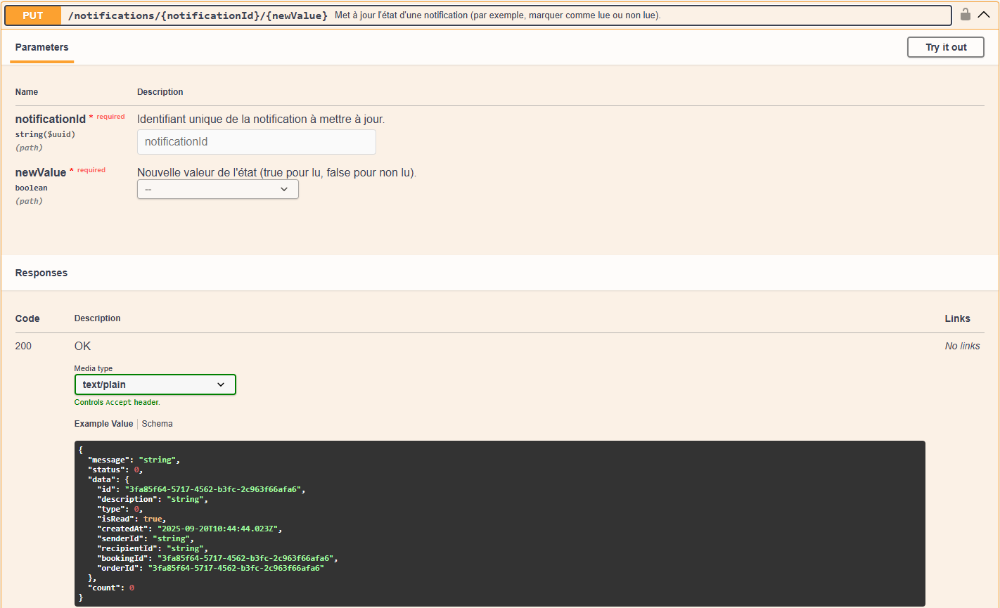
  <i  style="width: 90%;display: block; margin: auto;">
Un exempled d'endpoint qui permet de modifier le statut d’une notification (lue ou non lue). Deux paramètres d’entrée (via FromRoute) sont obligatoires : l’ID de la notification et la nouvelle valeur de type booléen. Et en vert, un exemple de retour.
</i>
</div>

#### Interface Swagger UI
L'interface Swagger UI offre une expérience interactive pour explorer et tester l'API directement depuis le navigateur. Cette interface auto-générée présente l'ensemble des endpoints organisés par contrôleurs, avec la possibilité d'exécuter des requêtes en temps réel et de visualiser les réponses correspondantes.

L'interface inclut des fonctionnalités avancées telles que l'authentification JWT intégrée, permettant aux développeurs de tester les endpoints sécurisés directement depuis l'interface de documentation. Cette capacité de test intégré accélère significativement le processus de développement et de debugging.

### 9.3 Processus de documentation des endpoints

#### Documentation des contrôleurs
Chaque contrôleur est documenté avec une description générale de ses fonctionnalités et de son domaine métier. Les tags Swagger permettent de regrouper logiquement les endpoints par domaine fonctionnel, facilitant la navigation dans une API comprenant de nombreux services.

```csharp

    /// <summary>
    /// Contrôleur pour gérer les utilisateurs.
    /// </summary>
    [Route("[controller]")]
    [Authorize]
    [ApiController]
    [Consumes("application/json")]
    [Produces("application/json")]
    public class UsersController : ControllerBase
    ....
```

#### Documentation des modèles de données
Les DTOs (Data Transfer Objects) et modèles de domaine sont exhaustivement documentés, incluant la description de chaque propriété, les contraintes de validation, et les exemples de valeurs. Cette documentation détaillée facilite l'intégration frontend et la compréhension des structures de données.

```csharp
/// <summary>
/// Modèle de données pour la connexion utilisateur
/// </summary>
public class UserLoginDTO
{
    /// <summary>
    /// Adresse email de l'utilisateur (format email valide requis)
    /// </summary>
    /// <example>utilisateur@exemple.com</example>
    [Required(ErrorMessage = "L'email est requis")]
    [EmailAddress(ErrorMessage = "Format d'email invalide")]
    public string Email { get; set; }\
    ...
}
```

### 9.4 Gestion des schémas de sécurité

La documentation Swagger intègre complètement le système de sécurité JWT de l'application. La configuration inclut la définition des schémas de sécurité Bearer Token, permettant aux utilisateurs de l'interface Swagger de s'authentifier et de tester les endpoints protégés.

```csharp
services.AddSwaggerGen(c =>
{
    c.AddSecurityDefinition("Bearer", new OpenApiSecurityScheme
    {
        Description = "JWT Authorization header using the Bearer scheme",
        Name = "Authorization",
        In = ParameterLocation.Header,
        Type = SecuritySchemeType.ApiKey,
        Scheme = "Bearer"
    });
    
    c.AddSecurityRequirement(new OpenApiSecurityRequirement
    {
        {
            new OpenApiSecurityScheme
            {
                Reference = new OpenApiReference
                {
                    Type = ReferenceType.SecurityScheme,
                    Id = "Bearer"
                }
            },
            new string[] {}
        }
    });
});
```

Cette configuration permet à Swagger de reconnaître automatiquement les endpoints nécessitant une authentification et d'afficher les contrôles appropriés dans l'interface utilisateur.

### 9.5 Génération automatique du client TypeScript

Un aspect particulièrement innovant de notre approche documentation concerne la génération automatique du client TypeScript pour le frontend Angular. Utilisant openapi-typescript-codegen, la spécification OpenAPI générée par Swagger sert de base pour créer automatiquement l'ensemble des services, modèles et types TypeScript correspondant exactement aux endpoints de l'API.

Ce processus de génération automatique présente plusieurs avantages majeurs : la synchronisation parfaite entre backend et frontend élimine les erreurs de typage, la productivité de développement est considérablement accélérée par l'auto-complétion native, et la maintenance est simplifiée car toute modification de l'API se répercute automatiquement dans le client TypeScript.

```bash
npx openapi-typescript-codegen --input http://localhost:7113/swagger/v1/swagger.json --output ./src/app/api --client angular
```
### 9.6 Déploiement et accessibilité de la documentation

La documentation Swagger est automatiquement déployée avec l'application et accessible via l'endpoint `/swagger` en environnement de développement et de test. Cette accessibilité garantit que les équipes de développement disposent toujours de la documentation la plus récente et peuvent tester les endpoints en temps réel.

En production, l'accès à la documentation peut être restreint pour des raisons de sécurité.

```csharp
 app.UseSwagger();
 if (!app.Environment.IsProduction())
 {
     app.UseSwaggerUI(c =>
     {
         c.SwaggerEndpoint("/swagger/v1/swagger.json", "data_lib v1");
         c.RoutePrefix = "swagger";
     });
 }
```

## 10. Maintenance et évolutivité
- Correctifs de bugs.
- Ajout futur de nouvelles fonctionnalités.
- Amélioration de l’expérience utilisateur.

---

## 11. Gestion de projet
- Méthodologie : Agile/Scrum.
- Planning.
- Suivi des tâches.

---

## 12. Conclusion
- Bilan.
- Limites.
- Perspectives.

---

## 13. Annexes
- Captures d’écran.
- Documentation API.
- Schéma BDD.

